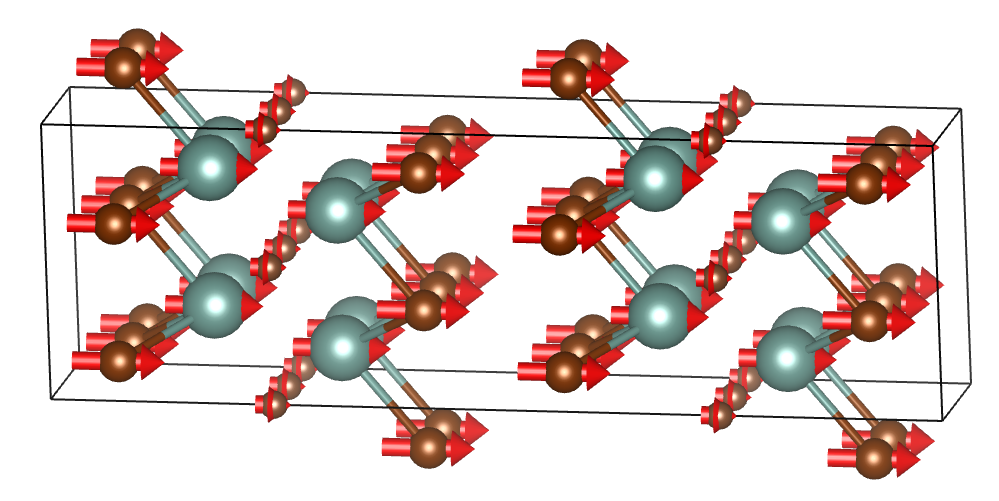

# Generate VESTA mode files from VASP OUTCAR files

### What this code does:
Automatic generates visualizations of vibrational modes
computed from the density functional theory (DFT) code
[VASP](https://www.vasp.at/), like this acoustic mode of
Y2CBr2:

### Details:
The file `modes_to_vesta.py` quickly converts the modes calculated in
a VASP density functional perturbation theory (DFPT) calculation (IBRION=7 or 8) to
the Visualization for Electronic and STructural Analysis [VESTA](http://jp-minerals.org/vesta/en/) file format.  The final result is a VESTA file that allows you to visualize each vibrational mode computed from DFPT.

### Usage:

In a single folder, you need the following 4 files:

1. `POSCAR` file, which is the POSCAR used as input to the DFPT calculation
2. `OUTCAR` file, which holds the results of an IBRION=7 or 8 calculation
3. `poscar.vesta` file.  This file is the direct result of opening the `POSCAR` file directly in vesta and saving the file with the filename `poscar` and extension `.vesta` (note that poscar is lower-case). No modes/displacement vectors should be visible in VESTA prior to saving.
4. `modes_to_vesta.py`, which comes from this repo.

To run, do the following:

	$  python modes_to_vest.py <optional-vesta-filename>

Only the first two arguments are needed; the third argument is optional and can be used to specify an alternative VESTA filename (i.e., a name different from `poscar.vesta`)

The result is a set of 3N files where N is the number of atoms in the unit cell. Each file has the format `mode_<freq>.vesta`, where <freq> is the mode frequency in cm-1. 